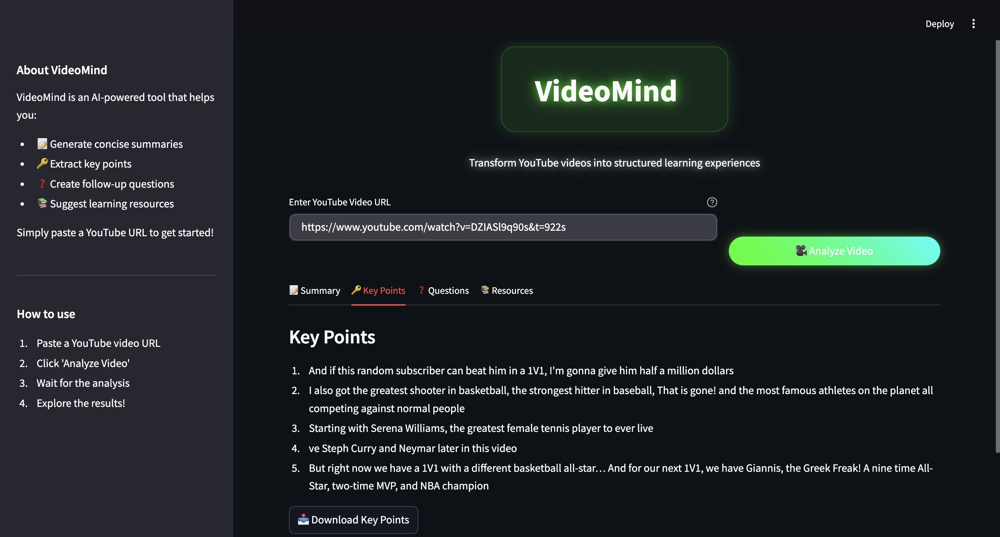

# 🎥 VideoMind-Youtube AI Analyzer

<div align="center">

[](https://www.python.org/downloads/)
[](https://streamlit.io/)
[](LICENSE)
[](https://openai.com/)
[](https://huggingface.co/)

</div>

## 🚀 Overview

YouTube AI Analyzer is a powerful tool that leverages artificial intelligence to analyze YouTube videos. It provides comprehensive insights including video summaries, key points, and generates relevant questions to enhance your learning experience.

## ✨ Features

- 📝 **Smart Summarization**: Get concise summaries of YouTube videos
- 🔑 **Key Points Extraction**: Identify and highlight important concepts
- ❓ **Question Generation**: Generate relevant questions to test understanding
- 📚 **Resource Suggestions**: Get additional learning resources
- 🎯 **Interactive UI**: User-friendly interface built with Streamlit

## 🎬 Additional Demo Video

[](https://drive.google.com/file/d/190lQvWGj1FjNAq0yOR6OjsH8LOcWNxev/view)

> Click the button above to view the second demo hosted on Google Drive.

## Screenshots

### 1. Home Page


### 2. Resources


### 3. Summary View


### 4. Key Points


### 5. Questions


## 🛠️ Installation

1. Clone the repository:
```bash
git clone https://github.com/yourusername/youtube-ai-analyzer.git
cd youtube-ai-analyzer
```

2. Create and activate a virtual environment:
```bash
python -m venv .venv
source .venv/bin/activate  # On Windows: .venv\Scripts\activate
```

3. Install dependencies:
```bash
pip install -r requirements.txt
```

4. Set up environment variables:
Create a `.env` file in the project root with:
```env
OPENAI_API_KEY=your_openai_api_key
HUGGINGFACE_API_KEY=your_huggingface_api_key
```

## 🚀 Usage

1. Start the Streamlit app:
```bash
streamlit run app/main.py
```

2. Open your browser and navigate to `http://localhost:8501`

3. Enter a YouTube video URL and click "Analyze"

4. View the analysis results and download reports as needed

## 🏗️ Project Structure

```
youtube-ai-analyzer/
├── app/
│   ├── main.py              # Streamlit application
│   └── utils.py             # Utility functions
├── backend/
│   ├── transcript_fetcher.py # YouTube transcript handling
│   ├── summarizer.py        # Video summarization
│   └── question_suggester.py # Question generation
├── assets/
│   └── icon16.png          # Application icon
├── .env                    # Environment variables
├── requirements.txt        # Project dependencies
└── README.md              # Project documentation
```

## 🔧 Dependencies

- Python 3.12+
- Streamlit
- OpenAI API
- HuggingFace Transformers
- youtube-transcript-api
- Other dependencies listed in `requirements.txt`

## 🤝 Contributing

Contributions are welcome! Please feel free to submit a Pull Request.

1. Fork the repository
2. Create your feature branch (`git checkout -b feature/AmazingFeature`)
3. Commit your changes (`git commit -m 'Add some AmazingFeature'`)
4. Push to the branch (`git push origin feature/AmazingFeature`)
5. Open a Pull Request

## 📝 License

This project is licensed under the MIT License - see the [LICENSE](LICENSE) file for details.

## 🙏 Acknowledgments

- OpenAI for providing the GPT-4 API
- HuggingFace for their transformer models
- Streamlit for the amazing web framework
- All contributors who have helped shape this project

---

<div align="center">
Made with ❤️ by [Vipul Pawar]
</div>


